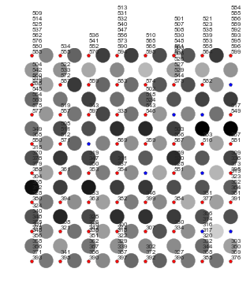
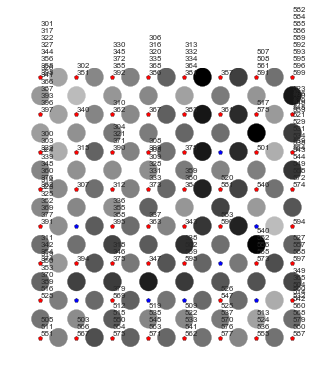

python -m nltk.downloader panlex_lite

# Part 1

## Exercise 1 : Animals

Q: We plotted the U-Matrix in the previous cell. What does it represent ? 

It represents the distance between neurons.

Q: What do the small stars represent ? What do the bigger circles represent ? 

Each small star is a neuron. The bigger circle represents a distance.

Q: What does the color in the big circles mean ? 

The darker the color the greater the distance is.

Q: What does the color in the small stars mean ? 

A red star is a class and a blue star is a hidden neuron.

Q: Plot the learning rate and the neighborood size. Why do you think we choose them like this? 

We choose it like this so that as we go further into the iterations we have a smaller learning rate which means we are more precise. The jump between iterations becomes smaller. And the neighborhood size becomes also smaller so that at  the begining every neuron is a neighboor then we diminsh the size meaning we divide the neurons.

## Exercise 1 : Animals

Q: Which of these five different 3d datasets are clustered correctly by Self-Organizing Map algorithm ? (to try with other datasets, you just have to change the dataset_name variable value and re-run the cells) 

GolfBall, Hepta, ChainLink, Atom, Tetra

Q: Which of these five different 3d datasets would K-Means correctly (or incorrectly) cluster ? Explain briefly why... 

Hepta would K-means correctly as in a 2D space we could draw a few lines to divide properly the different classes. Tetra would be quite good also but not as great as Hepta , as the division is not that clear.
GolfBall having only 1 class would do good in the K-Means as there is nothing to divide.
The other dataset would be quite messy and sometimes it would not K-Means correctly. For example Atom would be divided in more then two classes with K-Means.

# Part 2

Q: Try with several (minimum 3) different sets of images (always 100 images per class and at least two classes). You can change the size of the Self-Organizing Map as well as its parameters. Note that we provided three methods for extracting features: for at least one of the test you do try with all three methods and compare the results. 

This is our tries:
- [Dino VS Horse method 1](IMG/1DinoVSHorse.html)
- [Beach VS Mountain method 1](IMG/1PlageVSMountain.html)
- [Elephant VS Car method 1](IMG/1ElephantVSCar.html)

And the results for samples elephants and cars for each method:
- [Elephant VS Car method 1](IMG/1ElephantVSCar.html)
- [Elephant VS Car method 2](IMG/2ElephantVSCar.html)
- [Elephant VS Car method 3](IMG/3ElephantVSCar.html)

Q: Explain the three different methods we provided for extracting features. What do you understand about them (input, output), how do they work ?

- Method 1 :
    - Extract grey intensity histogram, Change the color image on black/white image and test the percentage of grey in image
- Method 2
    - Extract hue histogram, dominating wave length, shades, color tone
- Method 3
    - Extract color intensity histogram, Test the average of colors in images

Q: Include one or two results (U-Matrix (with distances) and U-Matrix (with images - print screen of html)) that you find interesting. Explain why you find it interesting (what are the input images, with which features you trained your Self-Organizing Map, with which parameters, and how it is reflected in the results)...

For the trie Elephant VS Car with the method 1 we can see the separation isn't good
- With the first method the shades of grey are almost the same between Elephant and Car. So the result with this method isn't good. The darker dot in the matrix don't make a proper and visible separation between classes.

For the same sample but with the methode 3 we have good results
- With the 3th method analysing color,  it is easier to see, in the matrix, the separation of classes if we follow the darker dots.

